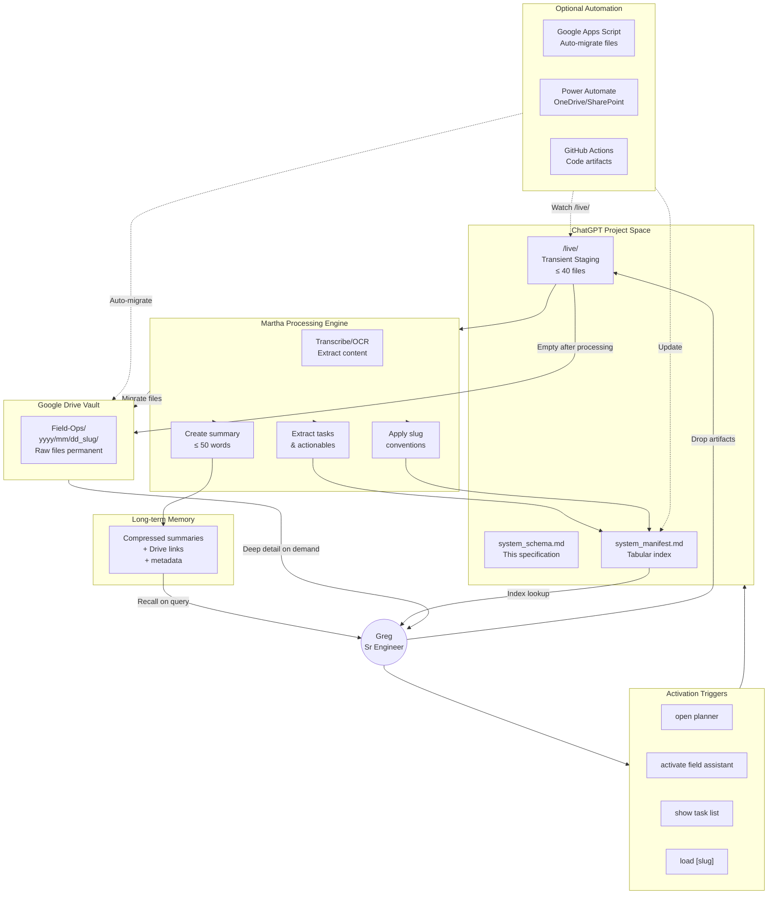

# Original Martha Architecture Diagram

## System Overview Flowchart

```mermaid
flowchart TB
    Greg((Greg<br/>Sr Engineer))
    
    subgraph Triggers["Activation Triggers"]
        T1["open planner"]
        T2["activate field assistant"]
        T3["show task list"]
        T4["load [slug]"]
    end
    
    subgraph ChatGPT["ChatGPT Project Space"]
        Live["/live/<br/>Transient Staging<br/>≤ 40 files"]
        Schema["system_schema.md<br/>This specification"]
        Manifest["system_manifest.md<br/>Tabular index"]
    end
    
    subgraph Processing["Martha Processing Engine"]
        Transcribe["Transcribe/OCR<br/>Extract content"]
        Summarize["Create summary<br/>≤ 50 words"]
        Extract["Extract tasks<br/>& actionables"]
        Tag["Apply slug<br/>conventions"]
    end
    
    subgraph Memory["Long-term Memory"]
        LTM["Compressed summaries<br/>+ Drive links<br/>+ metadata"]
    end
    
    subgraph Drive["Google Drive Vault"]
        Vault["Field-Ops/<br/>yyyy/mm/dd_slug/<br/>Raw files permanent"]
    end
    
    subgraph Automation["Optional Automation"]
        GAS["Google Apps Script<br/>Auto-migrate files"]
        PA["Power Automate<br/>OneDrive/SharePoint"]
        GHA["GitHub Actions<br/>Code artifacts"]
    end
    
    Greg --> Triggers
    Triggers --> ChatGPT
    Greg -->|Drop artifacts| Live
    
    Live --> Processing
    Processing --> Summarize
    Processing --> Extract
    Processing --> Tag
    
    Summarize --> LTM
    Extract --> Manifest
    Tag --> Manifest
    
    Processing -->|Migrate files| Drive
    Live -->|Empty after processing| Drive
    
    LTM -->|Recall on query| Greg
    Manifest -->|Index lookup| Greg
    Drive -->|Deep detail on demand| Greg
    
    Automation -.->|Watch /live/| Live
    Automation -.->|Auto-migrate| Drive
    Automation -.->|Update| Manifest
```

