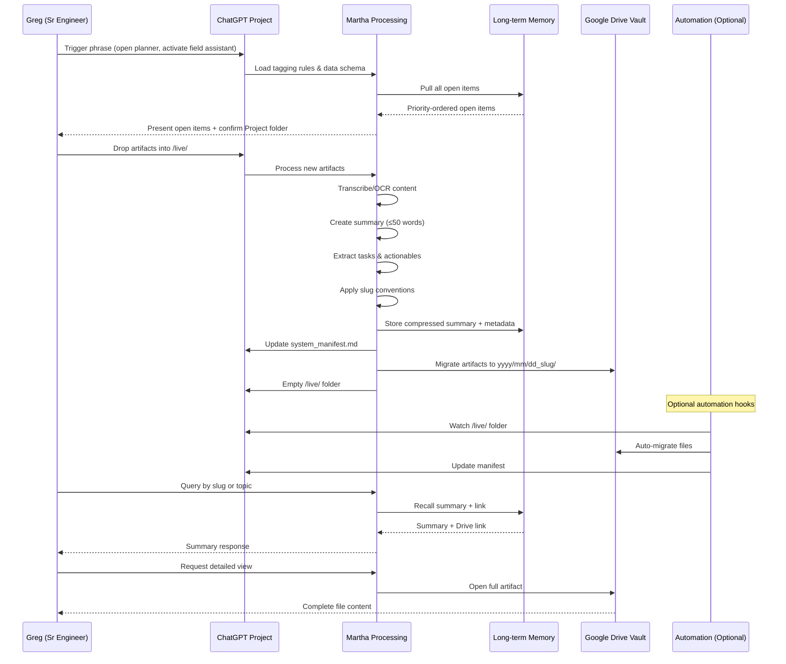

# Original Martha Sequence Diagram

## Workflow Sequence Diagram

```mermaid
sequenceDiagram
    participant Greg as Greg (Sr Engineer)
    participant ChatGPT as ChatGPT Project
    participant Martha as Martha Processing
    participant LTM as Long-term Memory
    participant Drive as Google Drive Vault
    participant Auto as Automation (Optional)

    Greg->>ChatGPT: Trigger phrase (open planner, activate field assistant)
    ChatGPT->>Martha: Load tagging rules & data schema
    Martha->>LTM: Pull all open items
    LTM-->>Martha: Priority-ordered open items
    Martha-->>Greg: Present open items + confirm Project folder

    Greg->>ChatGPT: Drop artifacts into /live/
    ChatGPT->>Martha: Process new artifacts
    Martha->>Martha: Transcribe/OCR content
    Martha->>Martha: Create summary (≤50 words)
    Martha->>Martha: Extract tasks & actionables
    Martha->>Martha: Apply slug conventions

    Martha->>LTM: Store compressed summary + metadata
    Martha->>ChatGPT: Update system_manifest.md
    Martha->>Drive: Migrate artifacts to yyyy/mm/dd_slug/
    Martha->>ChatGPT: Empty /live/ folder

    Note over Auto: Optional automation hooks
    Auto->>ChatGPT: Watch /live/ folder
    Auto->>Drive: Auto-migrate files
    Auto->>ChatGPT: Update manifest

    Greg->>Martha: Query by slug or topic
    Martha->>LTM: Recall summary + link
    LTM-->>Martha: Summary + Drive link
    Martha-->>Greg: Summary response
    
    Greg->>Martha: Request detailed view
    Martha->>Drive: Open full artifact
    Drive-->>Greg: Complete file content
```