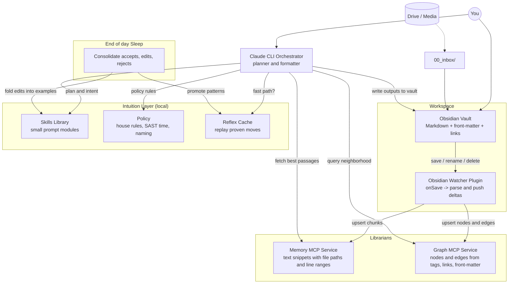

```mermaid
flowchart TB
    You((You))

    subgraph Workspace
        Obsidian["Obsidian Vault<br/>Markdown + front-matter + links"]
        Watcher["Obsidian Watcher Plugin<br/>onSave -> parse and push deltas"]
    end

    subgraph Librarians
        Memory["Memory MCP Service<br/>text snippets with file paths and line ranges"]
        Graph["Graph MCP Service<br/>nodes and edges from tags, links, front-matter"]
    end

    subgraph Intuition["Intuition Layer (local)"]
        Skills["Skills Library<br/>small prompt modules"]
        Policy["Policy<br/>house rules, SAST time, naming"]
        Reflex["Reflex Cache<br/>replay proven moves"]
    end

    CLI["Claude CLI Orchestrator<br/>planner and formatter"]

    Drive[("Drive / Media")]
    Inbox["00_inbox/"]

    You --> Obsidian
    You --> CLI
    Drive -.-> Inbox
    Inbox --> Obsidian

    Obsidian -->|save / rename / delete| Watcher
    Watcher -->|upsert chunks| Memory
    Watcher -->|upsert nodes and edges| Graph

    CLI -->|plan and intent| Skills
    CLI -->|policy rules| Policy
    CLI -->|fast path?| Reflex

    CLI -->|query neighborhood| Graph
    CLI -->|fetch best passages| Memory
    CLI -->|write outputs to vault| Obsidian

    subgraph Daily["End of day Sleep"]
        Sleep["Consolidate accepts, edits, rejects"]
    end
    Sleep -->|promote patterns| Reflex
    Sleep -->|fold edits into examples| Skills
```
