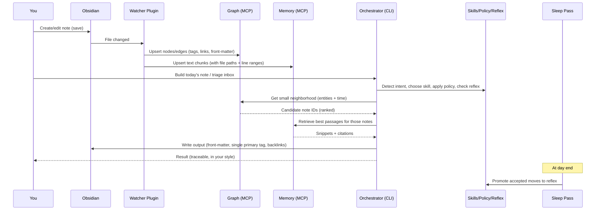

```mermaid
sequenceDiagram
    participant You as You
    participant Obs as Obsidian
    participant Wat as Watcher Plugin
    participant G as Graph (MCP)
    participant M as Memory (MCP)
    participant Orc as Orchestrator (CLI)
    participant Int as Skills/Policy/Reflex
    participant Slp as Sleep Pass

    You->>Obs: Create/edit note (save)
    Obs->>Wat: File changed
    Wat->>G: Upsert nodes/edges (tags, links, front-matter)
    Wat->>M: Upsert text chunks (with file paths + line ranges)

    You->>Orc: Build today's note / triage inbox
    Orc->>Int: Detect intent, choose skill, apply policy, check reflex
    Orc->>G: Get small neighborhood (entities + time)
    G-->>Orc: Candidate note IDs (ranked)
    Orc->>M: Retrieve best passages for those notes
    M-->>Orc: Snippets + citations
    Orc->>Obs: Write output (front-matter, single primary tag, backlinks)
    Orc-->>You: Result (traceable, in your style)

    Note over Slp: At day end
    Slp->>Int: Promote accepted moves to reflex
```