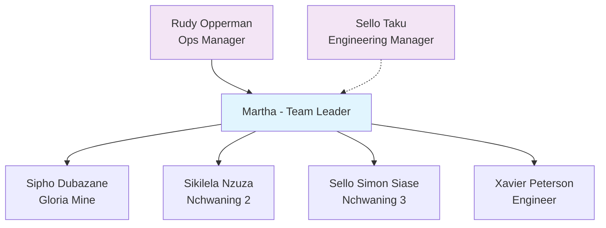

# Assmang Black Rock - Team Directory

## 👥 Martha's Engineering Team

### Team Structure

### 🎯 Team Members

| Name | Nickname | Role | Location | Contact |
|------|----------|------|----------|---------|
| **[[Sipho Dubazane]]** | Sipo | Engineer | Gloria Mine | [Contact info] |
| **[[Sikelela Nzuza]]** | Sk | Engineer | Nchwaning 2 | [Contact info] |
| **[[Sello Simon Siase]]** | Simon | Engineer | Nchwaning 3 | [Contact info] |
| **[[Xavier Peterson]]** | Xavier | Engineer | [Assignment TBD] | [Contact info] |

### 🏢 Management Chain

#### Direct Reporting
- **Manager**: [[Rudy Opperman]] (Operations Manager)
- **Team**: Martha's Engineering Team (4 engineers)

#### Matrix Reporting  
- **Technical Lead**: [[Sello Taku]] (Engineering Manager)
- **Relationship**: Dotted line for engineering/technical matters

### 🏭 Site Coverage

#### Gloria Mine
- **Engineer**: [[Sipho Dubazane]] (Sipo)
- **Responsibilities**: Site engineering support, maintenance, projects

#### Nchwaning 2  
- **Engineer**: [[Sikelela Nzuza]] (Sk)
- **Responsibilities**: Site engineering support, maintenance, projects

#### Nchwaning 3
- **Engineer**: [[Sello Simon Siase]] (Simon) 
- **Responsibilities**: Site engineering support, maintenance, projects

### 🤝 Key Stakeholders
- **[[Lawrence van Heerden]]** - Procurement Manager
- **[[Billy]]** - Training Department
- **SA Cranes** - External service provider

#team #directory #org-chart #engineering #assmang #year/2025